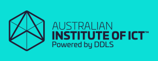

# MSSA-APAC-CAD1

### Class Information
[Daily class schedule](/Documents/CAD-Learning-Plan.md) 
[AIICT Study Spot Portal](https://www.studyspot.com.au/my/) 
[Course Intro](Documents/MSSA-CAD-Intro.md)

### Classroom Resources

[Microsoft Course Manuals (SkillPipe)](https://skillpipe.com) 
[Microsoft Labs (LearnOnDemand)](https://ddls.learnondemand.net/) 
[Register for SkillPipe Manuals and LearnOnDemand Labs](Documents/Course-and-Manuals.md)

### Teams Meeting

[Go to virtual classroom (Teams)](https://teams.microsoft.com/l/meetup-join/19%3a4f6a0cc49f524e50bc24745e3f828ad4%40thread.tacv2/1637297739159?context=%7b%22Tid%22%3a%226e640474-4dfe-443f-8c3f-6d1b6dffbcf6%22%2c%22Oid%22%3a%222cb25837-9388-4fc3-8378-efd462054183%22%7d)

### Trainer specific content

**Newton De Godoy**, 10975, Intro to Programming (No Content Provided) 
[**Mark Walsh**, 20483, C# Programming](https://github.com/Mark-AIICT/CAD-2) 
**Iain Morrison**, DP-080, Transact SQL (No Content Provided) 
**Arturo Bravo**, 20480 + 20486, HTML, Javascript, CSS (No Content Provided) 
**Steve Wiggins**, AZ-900 + AZ-204, Developing applications for Azure (No Content Provided) 

